# Diagramma delle Classi — Didasco LMS (Università Bocconi)

Versione: 1.1 — aggiornata al 2026-04-30

---

## Panoramica dell'architettura

L'applicazione segue il pattern **MVC (Model-View-Controller)** di ASP.NET Core 9.  
Nessun ORM: l'accesso ai dati avviene tramite classi **Repository** con query SQL raw via `MySqlConnector`.

```
┌─────────────────────────────────────────────────────────────────┐
│                        PRESENTATION LAYER                       │
│  Controllers (MVC)  ←→  Razor Views (.cshtml)  ←→  ViewModels  │
└────────────────────────────┬────────────────────────────────────┘
                             │ iniettano
┌────────────────────────────▼────────────────────────────────────┐
│                        SERVICE LAYER                            │
│  TranslationService · EmailService · AuditLogger               │
│  AppVersionService  · FeatureFlagService                       │
└────────────────────────────┬────────────────────────────────────┘
                             │ usano
┌────────────────────────────▼────────────────────────────────────┐
│                       DATA ACCESS LAYER                         │
│  *Repository (raw SQL via MySqlConnector)  ·  DbHelper         │
│  CustomUserStore  ·  CustomRoleStore                           │
└────────────────────────────┬────────────────────────────────────┘
                             │
┌────────────────────────────▼────────────────────────────────────┐
│                           DATABASE                              │
│                      MySQL (utf8mb4)                            │
└─────────────────────────────────────────────────────────────────┘
```

---

## Diagramma UML delle classi principali (Mermaid)

```mermaid
classDiagram
    class AccountController {
        -SignInManager signInManager
        -UserManager userManager
        -EmailService emailService
        -IAuditLogger audit
        +Login() IActionResult
        +Logout() IActionResult
        +ForgotPassword() IActionResult
        +ResetPassword() IActionResult
        +AccessDenied() IActionResult
    }

    class AdminController {
        -UserRepository users
        -RolePermissionRepository rolePerms
        -AreaRepository areas
        -DocumentTypeRepository docTypes
        -TranslationRepository translations
        -SettingsRepository settings
        -PlatformRepository platforms
        -MigrationRunner migrations
        -IAuditLogger audit
        +Dashboard() IActionResult
        +Users() IActionResult
        +CreateUser() IActionResult
        +EditUser() IActionResult
        +DeleteUser() IActionResult
        +CreateRole() IActionResult
        +EditRole() IActionResult
        +DeleteRole() IActionResult
        +Dictionary() IActionResult
        +Settings() IActionResult
        +Migrations() IActionResult
    }

    class CourseController {
        -CourseRepository courses
        -EnrollmentRepository enrollments
        -LessonRepository lessons
        -IAuditLogger audit
        +Index() IActionResult
        +Details() IActionResult
        +Create() IActionResult
        +Edit() IActionResult
        +Delete() IActionResult
        +Enroll() IActionResult
        +Unenroll() IActionResult
        +Publish() IActionResult
        +Unpublish() IActionResult
    }

    class LessonController {
        -LessonRepository lessons
        -CourseRepository courses
        -EnrollmentRepository enrollments
        -ProgressRepository progress
        -MaterialRepository materials
        -IAuditLogger audit
        +Details() IActionResult
        +Create() IActionResult
        +Edit() IActionResult
        +Delete() IActionResult
        +MarkComplete() IActionResult
    }

    class QuizController {
        -QuizRepository quizzes
        -EnrollmentRepository enrollments
        -IAuditLogger audit
        +Take() IActionResult
        +Submit() IActionResult
        +Result() IActionResult
        +History() IActionResult
        +CreateQuiz() IActionResult
        +DeleteQuiz() IActionResult
    }

    class MaterialsController {
        -MaterialRepository materials
        -DocumentTypeRepository docTypes
        -AreaRepository areas
        -PlatformRepository platforms
        -IAuditLogger audit
        +Index() IActionResult
        +Details() IActionResult
        +Create() IActionResult
        +Edit() IActionResult
        +Delete() IActionResult
        +UploadVersion() IActionResult
        +Download() IActionResult
        +ExportExcel() IActionResult
        +ExportPdf() IActionResult
    }

    class HomeController {
        -CourseRepository courses
        -MaterialRepository materials
        -EnrollmentRepository enrollments
        -UserRepository users
        -FeatureFlagService features
        -SettingsRepository settings
        -UserManager userManager
        +Index() IActionResult
        +Dashboard() IActionResult
        +NoModules() IActionResult
        +Error() IActionResult
        +Health() IActionResult
    }

    class LanguageController {
        +Set() IActionResult
    }

    class StudentController {
        -EnrollmentRepository enrollments
        -QuizRepository quizzes
        +Dashboard() IActionResult
    }

    class IAuditLogger {
        <<interface>>
        +Log(action, target, outcome, user, ip) void
        +LogMinimal(action, target, outcome, user, ip) void
        +IsEnabled bool
        +Level string
    }

    class AuditLogger {
        -ILogger logger
        -IHttpContextAccessor httpContextAccessor
        -bool IsEnabled
        -string Level
        +Log() void
        +LogMinimal() void
    }

    class TranslationService {
        -TranslationRepository repo
        -IMemoryCache cache
        -ISession session
        +T(key, fallback) string
    }

    class EmailService {
        -SmtpSettings settings
        +SendAsync(to, subject, body) Task
    }

    class FeatureFlagService {
        -SettingsRepository settings
        +IsEnabled(flag) bool
    }

    class DbHelper {
        -string connectionString
        +GetConnection() MySqlConnection
        +GetConnectionWithUserVariables() MySqlConnection
    }

    class CustomUserStore {
        -UserRepository users
        -RolePermissionRepository rolePerms
        +FindByEmailAsync() Task
        +FindByIdAsync() Task
        +GetPasswordHashAsync() Task
        +IsInRoleAsync() Task
    }

    class CustomRoleStore {
        -DbHelper db
        +FindByNameAsync() Task
        +CreateAsync() Task
        +DeleteAsync() Task
    }

    class MigrationRunner {
        -DbHelper db
        +RunAsync() Task
    }

    class HttpAccessLogMiddleware {
        -RequestDelegate next
        -ILogger logger
        +InvokeAsync(context) Task
    }

    AuditLogger ..|> IAuditLogger
    AccountController --> IAuditLogger
    AdminController --> IAuditLogger
    CourseController --> IAuditLogger
    LessonController --> IAuditLogger
    QuizController --> IAuditLogger
    MaterialsController --> IAuditLogger
    AccountController --> EmailService
    AdminController --> MigrationRunner
    HomeController --> FeatureFlagService
    TranslationService --> DbHelper
    CustomUserStore --> DbHelper
    CustomRoleStore --> DbHelper
    MigrationRunner --> DbHelper
```



---

## Controllers — dettaglio

### `AccountController`
- **Azioni:** `Login (GET/POST)`, `Logout (POST)`, `AccessDenied (GET)`, `ForgotPassword (GET/POST)`, `ResetPassword (GET/POST)`
- **Dipendenze:** `SignInManager<ApplicationUser>`, `UserManager<ApplicationUser>`, `IAuditLogger`, `EmailService`
- **Autenticazione:** Login via ASP.NET Identity + cookie; password hashing BCrypt

### `AdminController`
- **Azioni:** `Dashboard`, `Users`, `CreateUser (GET/POST)`, `EditUser (GET/POST)`, `DeleteUser (POST)`, `ToggleUserActive (POST)`, `Roles`, `CreateRole (GET/POST)`, `EditRole (GET/POST)`, `DeleteRole (POST)`, `Dictionary`, `CreateArea (POST)`, `DeleteArea (POST)`, `CreateDocumentType (POST)`, `DeleteDocumentType (POST)`, `Settings (GET/POST)`, `Translations`, `EditTranslation (GET/POST)`, `Platforms`, `CreatePlatform (POST)`, `DeletePlatform (POST)`, `Migrations`
- **Dipendenze:** `UserRepository`, `RolePermissionRepository`, `AreaRepository`, `DocumentTypeRepository`, `TranslationRepository`, `SettingsRepository`, `PlatformRepository`, `MigrationRunner`, `IAuditLogger`
- **Accesso:** Solo ruolo `Admin`

### `CourseController`
- **Azioni:** `Index`, `Details/{id}`, `Create (GET/POST)`, `Edit/{id} (GET/POST)`, `Delete (POST)`, `Enroll/{id} (POST)`, `Unenroll/{id} (POST)`, `Publish/{id} (POST)`, `Unpublish/{id} (POST)`
- **Dipendenze:** `CourseRepository`, `EnrollmentRepository`, `LessonRepository`, `IAuditLogger`
- **Accesso:** `[Authorize]`; creazione/modifica richiede `courses.teach`

### `LessonController`
- **Azioni:** `Details/{id}`, `Create (GET/POST)`, `Edit/{id} (GET/POST)`, `Delete (POST)`, `MarkComplete/{id} (POST)`
- **Dipendenze:** `LessonRepository`, `CourseRepository`, `EnrollmentRepository`, `ProgressRepository`, `MaterialRepository`, `IAuditLogger`
- **Accesso:** `[Authorize]`; creazione/modifica richiede `courses.teach`

### `QuizController`
- **Azioni:** `Take/{id}`, `Submit/{id} (POST)`, `Result/{attemptId}`, `History`, `CreateQuiz (GET/POST)`, `DeleteQuiz/{id} (POST)`
- **Dipendenze:** `QuizRepository`, `EnrollmentRepository`, `IAuditLogger`
- **Accesso:** `[Authorize]`

### `MaterialsController`
- **Azioni:** `Index`, `Details/{id}`, `Create (GET/POST)`, `Edit/{id} (GET/POST)`, `Delete/{id} (POST)`, `UploadVersion (POST)`, `Download/{id}`, `ExportExcel`, `ExportPdf`
- **Dipendenze:** `MaterialRepository`, `DocumentTypeRepository`, `AreaRepository`, `PlatformRepository`, `IAuditLogger`
- **Accesso:** lettura = `[Authorize]`; creazione/modifica = `materials.*`

### `HomeController`
- **Azioni:** `Index`, `Dashboard`, `NoModules`, `Error`, `Health`
- **Dipendenze:** `CourseRepository`, `MaterialRepository`, `EnrollmentRepository`, `UserRepository`, `FeatureFlagService`, `SettingsRepository`, `UserManager<ApplicationUser>`, `IWebHostEnvironment`

### `LanguageController`
- **Azioni:** `Set (POST)` — imposta il cookie `lang` con scadenza 1 anno
- **Dipendenze:** `IResponseCookies` (via `Response.Cookies`)
- **Note:** non usa `ISession`; preferisce un cookie permanente

### `StudentController`
- **Azioni:** `Dashboard`
- **Dipendenze:** `EnrollmentRepository`, `QuizRepository`

---

## Models (Dominio)

```
ApplicationUser          : IdentityUser<int>
  + Id          : int
  + Email       : string
  + FirstName   : string
  + LastName    : string
  + Role        : string
  + IsActive    : bool
  + CreatedAt   : DateTime

ApplicationRole          : IdentityRole<int>
  + Id              : int
  + Name            : string
  + NormalizedName  : string
  + CreatedAt       : DateTime

Course
  + Id          : int
  + Title       : string
  + Description : string
  + Category    : string
  + TeacherId   : int
  + StartDate   : DateTime?
  + EndDate     : DateTime?
  + IsPublished : bool

Lesson
  + Id          : int
  + CourseId    : int
  + Title       : string
  + Content     : string?
  + SortOrder   : int
  + IsPublished : bool

Quiz
  + Id                : int
  + LessonId          : int
  + Title             : string
  + Description       : string?
  + TimeLimitMinutes  : int
  + PassingScore      : int

QuizQuestion
  + Id           : int
  + QuizId       : int
  + QuestionText : string
  + SortOrder    : int

QuizOption
  + Id         : int
  + QuestionId : int
  + OptionText : string
  + IsCorrect  : bool
  + SortOrder  : int

Enrollment
  + Id         : int
  + UserId     : int
  + CourseId   : int
  + EnrolledAt : DateTime

Material
  + Id                    : int
  + Title                 : string
  + AuthorName            : string?
  + OwnerId               : int?
  + Language              : string
  + DocumentTypeId        : int?
  + Status                : string
  + FolderId              : int?
  + AreaId                : int?
  + PlatformId            : int?
  + IsPublished           : bool
  + IsPublishable         : bool
  + ProtocolNumber        : int?
  + PageCount             : int?

Area
  + Id        : int
  + Name      : string
  + SortOrder : int

QuizAttempt
  + Id             : int
  + QuizId         : int
  + UserId         : int
  + Score          : int
  + TotalQuestions : int
  + CorrectAnswers : int
  + Passed         : bool
  + AttemptedAt    : DateTime
```

---

## ViewModels (`Models/ViewModels.cs`)

| ViewModel                     | Scopo                                               |
|-------------------------------|-----------------------------------------------------|
| `LoginViewModel`              | Form di login (Email, Password, RememberMe)         |
| `ForgotPasswordViewModel`     | Form recupero password                              |
| `ResetPasswordViewModel`      | Form reset password con token                       |
| `CourseCreateViewModel`       | Creazione/modifica corso                            |
| `CourseDetailsViewModel`      | Vista dettaglio corso con iscrizione                |
| `LessonCreateViewModel`       | Creazione/modifica lezione                          |
| `QuizCreateViewModel`         | Creazione quiz con domande/opzioni                  |
| `QuizTakeViewModel`           | Presentazione quiz allo studente                    |
| `QuizResultViewModel`         | Risultato tentativo quiz                            |
| `MaterialCreateViewModel`     | Creazione/modifica materiale                        |
| `MaterialIndexViewModel`      | Elenco materiali con filtri                         |
| `AdminUserListViewModel`      | Elenco utenti per pannello Admin                    |
| `CreateUserViewModel`         | Form creazione utente da Admin                      |
| `RoleEditViewModel`           | Modifica ruolo con permessi                         |
| `DashboardViewModel`          | Dati aggregati per la dashboard                     |

---

## Data Access Layer

### `DbHelper`
- Wrapper singleton su `MySqlConnectionStringBuilder`
- Metodi: `GetConnection()`, `GetConnectionWithUserVariables()`
- `GetConnectionWithUserVariables()` imposta `@lms_user` per tracciamento SQL

### Repository Pattern

Ogni repository riceve `DbHelper` via DI e apre connessioni on-demand.

| Repository                  | Tabelle principali               | Note                                         |
|-----------------------------|----------------------------------|----------------------------------------------|
| `UserRepository`            | `users`                          | CRUD utenti, cambio password, cambio ruolo   |
| `CourseRepository`          | `courses`                        | CRUD corsi, pubblicazione                    |
| `LessonRepository`          | `lessons`                        | CRUD lezioni, ordinamento                    |
| `QuizRepository`            | `quizzes`, `quiz_questions`, `quiz_options`, `quiz_attempts` | Gestione quiz completo |
| `EnrollmentRepository`      | `enrollments`                    | Iscrizione/disiscrizione                     |
| `ProgressRepository`        | `lesson_progress`                | Completamento lezioni                        |
| `MaterialRepository`        | `materials`, `material_versions`, `lesson_materials` | Libreria documenti      |
| `DocumentTypeRepository`    | `document_types`                 |                                              |
| `AreaRepository`            | `areas`, `user_areas`            |                                              |
| `PlatformRepository`        | `platforms`                      |                                              |
| `RolePermissionRepository`  | `role_permissions`               | Permessi funzionali per ruolo                |
| `TranslationRepository`     | `translations`                   | Stringhe UI multilingua                      |
| `SettingsRepository`        | `app_settings`                   | Feature flags e configurazioni runtime       |

### `CustomUserStore`
- Implementa `IUserStore<ApplicationUser>`, `IUserPasswordStore`, `IUserRoleStore`
- Usa `UserRepository` e `RolePermissionRepository` per verificare `courses.teach`/`courses.attend`

### `CustomRoleStore`
- Implementa `IRoleStore<ApplicationRole>`
- Gestisce `roles` + `role_permissions`

### `MigrationRunner`
- Esegue al boot le migrazioni SQL ordinate in `Migrations/`
- Tiene traccia delle migrazioni già applicate su tabella `schema_migrations`
- Usa `GetConnectionWithUserVariables()` per l'esecuzione
- Fail-fast: qualsiasi errore interrompe il boot dell'applicazione

---

## Services

### `IAuditLogger` / `AuditLogger`
- Singleton
- `Log(action, target, outcome)` — livello standard (skippato se Level=minimal)
- `LogMinimal(action, target, outcome)` — sempre scritto (autenticazione)
- Legge `AuditLog:Enabled` e `AuditLog:Level` da `appsettings.json`

### `TranslationService`
- Scoped — carica le traduzioni dal DB e le mette in cache (`IMemoryCache`)
- `T(key, fallback)` — restituisce la traduzione per la lingua corrente (da cookie `lang`)

### `EmailService`
- Scoped — invia e-mail via SMTP usando MailKit
- Configurazione letta da `appsettings.json` sezione `Smtp`

### `AppVersionService`
- Singleton — legge la versione dall'assembly e la espone a tutte le view

### `FeatureFlagService`
- Scoped — legge i feature flag da `SettingsRepository` con cache

### `LessonReminderHostedService`
- `IHostedService` — invia e-mail di promemoria alle scadenze dei corsi

---

## Middleware

### `HttpAccessLogMiddleware`
- Registrato dopo `UseAuthentication`, prima di `UseAuthorization`
- Logga ogni richiesta HTTP con tag `[HTTP-ACCESS]`
- Skip automatico per `/health` e `/favicon.ico`

---

## Glossario

| Termine              | Significato                                                                  |
|----------------------|------------------------------------------------------------------------------|
| MVC                  | Model-View-Controller — pattern architetturale di ASP.NET Core               |
| Repository           | Classe che incapsula l'accesso ai dati per una o più tabelle correlate       |
| ViewModel            | Oggetto trasferito dal Controller alla View; non corrisponde 1:1 al dominio  |
| Singleton            | Istanza unica per tutta la durata dell'applicazione                          |
| Scoped               | Istanza unica per ogni richiesta HTTP                                        |
| DI                   | Dependency Injection — meccanismo ASP.NET Core per fornire dipendenze        |
| IHostedService       | Servizio di background eseguito dal runtime ASP.NET Core                     |
| IdentityUser         | Classe base ASP.NET Identity per gli utenti autenticati                      |
| CustomUserStore      | Implementazione personalizzata di Identity Store che usa MySQL direttamente  |
| Feature Flag         | Valore runtime che abilita/disabilita funzionalità senza rideploy            |
| `courses.teach`      | Permesso che abilita la creazione e gestione di corsi                        |
| `courses.attend`     | Permesso che abilita l'iscrizione ai corsi                                   |
