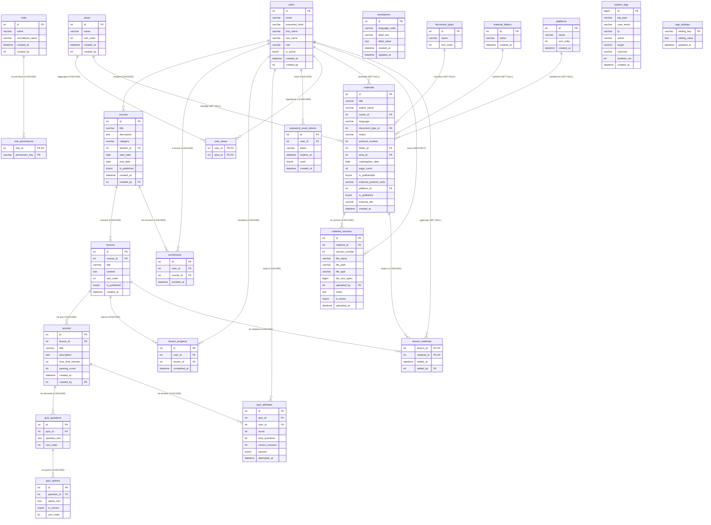

# Diagramma E-R — Didasco LMS (Università Bocconi)

Versione: 1.2 — aggiornata al 2026-05-02  
Fonte: `artifacts/bocconi-lms/schema.sql` (DDL completo + seed iniziale, idempotente)

---

## Diagramma E-R (Mermaid)

---

## Comportamento FK all'eliminazione — riepilogo

| FK                                     | Azione        | Effetto                                              |
|----------------------------------------|---------------|------------------------------------------------------|
| `courses.teacher_id → users`           | CASCADE       | Eliminando un utente si eliminano tutti i suoi corsi |
| `courses.created_by → users`           | SET NULL      | Il campo diventa NULL                                |
| `material_versions.uploaded_by → users`| RESTRICT (default) | Impossibile eliminare un utente con versioni caricate; richiede pulizia manuale prima |
| `materials.owner_id → users`           | SET NULL      | Il campo diventa NULL                                |
| `lesson_materials.added_by → users`    | SET NULL      | Il campo diventa NULL                                |
| `quizzes.created_by → users`           | SET NULL      | Il campo diventa NULL                                |
| `enrollments.user_id → users`          | CASCADE       | Le iscrizioni vengono eliminate                      |
| `lesson_progress.user_id → users`      | CASCADE       | Il progresso viene eliminato                         |
| `quiz_attempts.user_id → users`        | CASCADE       | I tentativi quiz vengono eliminati                   |
| `password_reset_tokens.user_id → users`| CASCADE       | I token vengono eliminati                            |
| `user_areas.user_id → users`           | CASCADE       | Le associazioni area vengono eliminate               |
| `role_permissions.role_id → roles`     | CASCADE       | I permessi del ruolo vengono eliminati               |

---

## Dettaglio tabelle

### `users`
| Colonna        | Tipo             | Vincoli                  | Descrizione                         |
|----------------|------------------|--------------------------|-------------------------------------|
| id             | INT              | PK, AUTO_INCREMENT       | Identificativo univoco utente       |
| email          | VARCHAR(255)     | NOT NULL, UNIQUE         | Indirizzo e-mail (login)            |
| password_hash  | VARCHAR(255)     | NOT NULL                 | Hash BCrypt della password          |
| first_name     | VARCHAR(100)     | NOT NULL                 | Nome                                |
| last_name      | VARCHAR(100)     | NOT NULL                 | Cognome                             |
| role           | VARCHAR(50)      | NOT NULL DEFAULT ''      | Nome del ruolo (denormalizzato)     |
| is_active      | TINYINT(1)       | NOT NULL DEFAULT 1       | 1 = attivo, 0 = disattivato         |
| created_at     | DATETIME         | NOT NULL DEFAULT NOW()   | Data creazione record               |
| created_by     | INT NULL         | —                        | ID utente che ha creato il record   |

**Indici:** `idx_email(email)`, `idx_role(role)`

---

### `roles`
| Colonna          | Tipo         | Vincoli                  | Descrizione                         |
|------------------|--------------|--------------------------|-------------------------------------|
| id               | INT          | PK, AUTO_INCREMENT       | Identificativo ruolo                |
| name             | VARCHAR(256) | NOT NULL                 | Nome leggibile (es. "Teacher")      |
| normalized_name  | VARCHAR(256) | NOT NULL, UNIQUE         | Versione maiuscola per ricerca      |
| created_at       | DATETIME     | NOT NULL DEFAULT NOW()   | Data creazione                      |
| created_by       | INT NULL     | —                        | Utente creatore                     |

---

### `role_permissions`
| Colonna        | Tipo         | Vincoli                           | Descrizione                          |
|----------------|--------------|-----------------------------------|--------------------------------------|
| role_id        | INT          | PK (composita), FK → roles(id) CASCADE | Ruolo di riferimento            |
| permission_key | VARCHAR(50)  | PK (composita)                    | Chiave permesso (es. `courses.teach`)|

**Permessi disponibili:** `courses.teach`, `courses.attend`, `menu.materials`, `materials.*`, `menu.users`, `menu.translations`

---

### `courses`
| Colonna      | Tipo         | Vincoli                                  | Descrizione                         |
|--------------|--------------|------------------------------------------|-------------------------------------|
| id           | INT          | PK, AUTO_INCREMENT                       |                                     |
| title        | VARCHAR(255) | NOT NULL                                 | Titolo del corso                    |
| description  | TEXT         | NOT NULL                                 | Descrizione                         |
| category     | VARCHAR(100) | NOT NULL                                 | Categoria/area tematica             |
| teacher_id   | INT          | NOT NULL, FK → users(id) **CASCADE**     | Docente responsabile; se eliminato il corso viene eliminato |
| start_date   | DATE         | NULL                                     | Data inizio                         |
| end_date     | DATE         | NULL                                     | Data fine                           |
| is_published | TINYINT(1)   | NOT NULL DEFAULT 0                       | 1 = pubblicato, 0 = non pubblicato  |
| created_at   | DATETIME     | NOT NULL DEFAULT NOW()                   |                                     |
| created_by   | INT NULL     | FK → users(id) SET NULL                  |                                     |

---

### `lessons`
| Colonna      | Tipo         | Vincoli                            | Descrizione                       |
|--------------|--------------|------------------------------------|-----------------------------------|
| id           | INT          | PK, AUTO_INCREMENT                 |                                   |
| course_id    | INT          | NOT NULL, FK → courses(id) CASCADE |                                   |
| title        | VARCHAR(255) | NOT NULL                           |                                   |
| content      | TEXT         | NULL                               | Testo HTML della lezione          |
| sort_order   | INT          | NOT NULL DEFAULT 0                 | Ordine nella sequenza             |
| is_published | TINYINT(1)   | NOT NULL DEFAULT 0                 |                                   |
| created_at   | DATETIME     | NOT NULL DEFAULT NOW()             |                                   |

---

### `quizzes`
| Colonna             | Tipo         | Vincoli                             | Descrizione                         |
|---------------------|--------------|-------------------------------------|-------------------------------------|
| id                  | INT          | PK, AUTO_INCREMENT                  |                                     |
| lesson_id           | INT          | NOT NULL, FK → lessons(id) CASCADE  |                                     |
| title               | VARCHAR(255) | NOT NULL                            |                                     |
| description         | TEXT         | NULL                                |                                     |
| time_limit_minutes  | INT          | NOT NULL DEFAULT 30                 | Limite di tempo in minuti           |
| passing_score       | INT          | NOT NULL DEFAULT 60                 | Punteggio minimo (percentuale)      |
| created_at          | DATETIME     | NOT NULL DEFAULT NOW()              |                                     |
| created_by          | INT NULL     | FK → users(id) SET NULL             |                                     |

---

### `quiz_questions`
| Colonna       | Tipo | Vincoli                            | Descrizione              |
|---------------|------|------------------------------------|--------------------------|
| id            | INT  | PK, AUTO_INCREMENT                 |                          |
| quiz_id       | INT  | NOT NULL, FK → quizzes(id) CASCADE |                          |
| question_text | TEXT | NOT NULL                           | Testo della domanda      |
| sort_order    | INT  | NOT NULL DEFAULT 0                 | Ordine di presentazione  |

---

### `quiz_options`
| Colonna     | Tipo       | Vincoli                                   | Descrizione                       |
|-------------|------------|-------------------------------------------|-----------------------------------|
| id          | INT        | PK, AUTO_INCREMENT                        |                                   |
| question_id | INT        | NOT NULL, FK → quiz_questions(id) CASCADE |                                   |
| option_text | TEXT       | NOT NULL                                  | Testo dell'opzione di risposta    |
| is_correct  | TINYINT(1) | NOT NULL DEFAULT 0                        | 1 = risposta corretta             |
| sort_order  | INT        | NOT NULL DEFAULT 0                        |                                   |

---

### `enrollments`
| Colonna     | Tipo     | Vincoli                              | Descrizione                    |
|-------------|----------|--------------------------------------|--------------------------------|
| id          | INT      | PK, AUTO_INCREMENT                   |                                |
| user_id     | INT      | NOT NULL, FK → users(id) CASCADE     | Studente iscritto              |
| course_id   | INT      | NOT NULL, FK → courses(id) CASCADE   |                                |
| enrolled_at | DATETIME | NOT NULL DEFAULT NOW()               | Timestamp iscrizione           |

**Vincolo unico:** `(user_id, course_id)`

---

### `lesson_progress`
| Colonna      | Tipo     | Vincoli                             | Descrizione                  |
|--------------|----------|-------------------------------------|------------------------------|
| id           | INT      | PK, AUTO_INCREMENT                  |                              |
| user_id      | INT      | NOT NULL, FK → users(id) CASCADE    |                              |
| lesson_id    | INT      | NOT NULL, FK → lessons(id) CASCADE  |                              |
| completed_at | DATETIME | NOT NULL DEFAULT NOW()              | Timestamp completamento      |

**Vincolo unico:** `(user_id, lesson_id)`

---

### `quiz_attempts`
| Colonna         | Tipo       | Vincoli                            | Descrizione                         |
|-----------------|------------|------------------------------------|-------------------------------------|
| id              | INT        | PK, AUTO_INCREMENT                 |                                     |
| quiz_id         | INT        | NOT NULL, FK → quizzes(id) CASCADE |                                     |
| user_id         | INT        | NOT NULL, FK → users(id) CASCADE   |                                     |
| score           | INT        | NOT NULL                           | Punteggio percentuale (0–100)       |
| total_questions | INT        | NOT NULL                           |                                     |
| correct_answers | INT        | NOT NULL                           |                                     |
| passed          | TINYINT(1) | NOT NULL DEFAULT 0                 | 1 = superato                        |
| attempted_at    | DATETIME   | NOT NULL DEFAULT NOW()             |                                     |

---

### `password_reset_tokens`
| Colonna    | Tipo         | Vincoli                          | Descrizione                    |
|------------|--------------|----------------------------------|--------------------------------|
| id         | INT          | PK, AUTO_INCREMENT               |                                |
| user_id    | INT          | NOT NULL, FK → users(id) CASCADE |                                |
| token      | VARCHAR(64)  | NOT NULL, UNIQUE                 | Token crittograficamente sicuro|
| expires_at | DATETIME     | NOT NULL                         | Scadenza (es. +24h)            |
| used       | TINYINT(1)   | NOT NULL DEFAULT 0               | 1 = già utilizzato             |
| created_at | DATETIME     | NOT NULL DEFAULT NOW()           |                                |

---

### `areas`
| Colonna    | Tipo         | Vincoli                | Descrizione              |
|------------|--------------|------------------------|--------------------------|
| id         | INT          | PK, AUTO_INCREMENT     |                          |
| name       | VARCHAR(255) | NOT NULL               | Nome dell'area           |
| sort_order | INT          | NOT NULL DEFAULT 0     | Ordinamento              |
| created_at | DATETIME     | NOT NULL DEFAULT NOW() |                          |
| created_by | INT NULL     | —                      |                          |

---

### `user_areas`
| Colonna | Tipo | Vincoli                                | Descrizione                |
|---------|------|----------------------------------------|----------------------------|
| user_id | INT  | PK (composita), FK → users(id) CASCADE | Utente assegnato all'area  |
| area_id | INT  | PK (composita), FK → areas(id) CASCADE | Area di appartenenza       |

---

### `translations`
| Colonna       | Tipo         | Vincoli                             | Descrizione                         |
|---------------|--------------|-------------------------------------|-------------------------------------|
| id            | INT          | PK, AUTO_INCREMENT                  |                                     |
| language_code | VARCHAR(10)  | NOT NULL                            | Codice lingua (es. `it`, `en`)      |
| label_key     | VARCHAR(255) | NOT NULL                            | Chiave della stringa                |
| label_value   | TEXT         | NOT NULL                            | Testo tradotto                      |
| created_at    | DATETIME     | NOT NULL DEFAULT NOW()              |                                     |
| updated_at    | DATETIME     | NOT NULL, aggiornato automaticamente|                                     |

**Vincolo unico:** `(language_code, label_key)`

---

### `materials`
| Colonna                | Tipo         | Vincoli                                    | Descrizione                         |
|------------------------|--------------|--------------------------------------------|-------------------------------------|
| id                     | INT          | PK, AUTO_INCREMENT                         |                                     |
| title                  | VARCHAR(255) | NOT NULL, UNIQUE                           |                                     |
| author_name            | VARCHAR(255) | NULL                                       | Autore esterno (testo libero)       |
| owner_id               | INT NULL     | FK → users(id) SET NULL                    | Utente proprietario                 |
| language               | VARCHAR(50)  | NOT NULL DEFAULT 'Italiano'                |                                     |
| document_type_id       | INT NULL     | FK → document_types(id) SET NULL           |                                     |
| status                 | VARCHAR(50)  | NOT NULL DEFAULT 'draft'                   | `draft`, `under_review`, `verified` |
| protocol_number        | INT NULL     | —                                          | Numero protocollo interno           |
| folder_id              | INT NULL     | FK → material_folders(id) SET NULL         |                                     |
| area_id                | INT NULL     | FK → areas(id) SET NULL                    |                                     |
| catalogation_date      | DATE NULL    | —                                          | Data catalogazione                  |
| page_count             | INT NULL     | —                                          | Numero di pagine                    |
| is_publishable         | TINYINT(1)   | NOT NULL DEFAULT 0                         |                                     |
| external_protocol_code | VARCHAR(100) | NULL                                       |                                     |
| platform_id            | INT NULL     | FK → platforms(id) SET NULL                |                                     |
| is_published           | TINYINT(1)   | NOT NULL DEFAULT 0                         |                                     |
| external_link          | VARCHAR(500) | NULL                                       |                                     |
| created_at             | DATETIME     | NOT NULL DEFAULT NOW()                     |                                     |

---

### `material_versions`
| Colonna        | Tipo         | Vincoli                                       | Descrizione                    |
|----------------|--------------|-----------------------------------------------|--------------------------------|
| id             | INT          | PK, AUTO_INCREMENT                            |                                |
| material_id    | INT          | NOT NULL, FK → materials(id) CASCADE          |                                |
| version_number | INT          | NOT NULL                                      | Numero versione (1, 2…)        |
| file_name      | VARCHAR(255) | NOT NULL                                      |                                |
| file_path      | VARCHAR(500) | NOT NULL                                      | Percorso file su disco         |
| file_type      | VARCHAR(20)  | NOT NULL                                      | Estensione (pdf, docx…)        |
| file_size_bytes| BIGINT       | NOT NULL DEFAULT 0                            |                                |
| uploaded_by    | INT          | NOT NULL, FK → users(id) **RESTRICT**         | Non eliminabile se riferito    |
| notes          | TEXT         | NULL                                          |                                |
| is_active      | TINYINT(1)   | NOT NULL DEFAULT 1                            | 1 = versione corrente          |
| uploaded_at    | DATETIME     | NOT NULL DEFAULT NOW()                        |                                |

**Vincolo unico:** `(material_id, version_number)`

---

### `lesson_materials`
| Colonna     | Tipo     | Vincoli                                    | Descrizione               |
|-------------|----------|--------------------------------------------|---------------------------|
| lesson_id   | INT      | PK (composita), FK → lessons(id) CASCADE   |                           |
| material_id | INT      | PK (composita), FK → materials(id) CASCADE |                           |
| added_at    | DATETIME | NOT NULL DEFAULT NOW()                     |                           |
| added_by    | INT NULL | FK → users(id) SET NULL                    |                           |

---

### `document_types`
| Colonna    | Tipo         | Vincoli            | Descrizione          |
|------------|--------------|--------------------|----------------------|
| id         | INT          | PK, AUTO_INCREMENT |                      |
| name       | VARCHAR(255) | NOT NULL, UNIQUE   | Es. "PDF", "Video"   |
| sort_order | INT          | NOT NULL DEFAULT 0 |                      |

---

### `material_folders`
| Colonna    | Tipo         | Vincoli                | Descrizione      |
|------------|--------------|------------------------|------------------|
| id         | INT          | PK, AUTO_INCREMENT     |                  |
| name       | VARCHAR(255) | NOT NULL, UNIQUE       | Nome cartella    |
| created_at | DATETIME     | NOT NULL DEFAULT NOW() |                  |

---

### `platforms`
| Colonna    | Tipo         | Vincoli                | Descrizione                     |
|------------|--------------|------------------------|---------------------------------|
| id         | INT          | PK, AUTO_INCREMENT     |                                 |
| name       | VARCHAR(255) | NOT NULL, UNIQUE       | Es. "YouTube", "Moodle"         |
| sort_order | INT          | NOT NULL DEFAULT 0     |                                 |
| created_at | DATETIME     | NOT NULL DEFAULT NOW() |                                 |

---

### `system_logs`
| Colonna     | Tipo         | Vincoli                              | Descrizione                                                                 |
|-------------|--------------|--------------------------------------|-----------------------------------------------------------------------------|
| id          | BIGINT       | PK, AUTO_INCREMENT                   | Identificativo del record                                                  |
| log_type    | VARCHAR(20)  | NOT NULL, INDEX `idx_type`           | Categoria (`http_access`, `app_audit`)                                     |
| user_email  | VARCHAR(255) | NULL, INDEX `idx_user`               | E-mail utente (NULL se anonimo)                                            |
| ip          | VARCHAR(45)  | NULL                                 | Indirizzo IP del client (supporta IPv4/IPv6)                               |
| action      | VARCHAR(500) | NOT NULL                             | Identificatore azione (es. `auth.login`, `course.create`) o `METHOD PATH STATUS` |
| target      | VARCHAR(500) | NULL                                 | Risorsa coinvolta (es. `course#42`)                                        |
| outcome     | VARCHAR(50)  | NULL                                 | Esito (`success`, `failure`)                                               |
| duration_ms | INT          | NULL                                 | Durata richiesta in ms (solo HTTP access)                                  |
| created_at  | DATETIME(3)  | NOT NULL DEFAULT CURRENT_TIMESTAMP(3)| Timestamp con precisione al millisecondo                                   |

**Uso:** alimentata in fire-and-forget da `SystemLogRepository` (canale secondario di logging — vedi `log-strategy.md`). Non ha FK verso altre tabelle (per non bloccare le scritture audit). Consultabile dall'Admin via **Admin → Log di Sistema**. Pulizia manuale via purge (30/90 giorni o tutto). Le scritture sono disattivabili con il flag `AuditLog:WriteToDatabase` in `appsettings.json`.

> **GDPR (art. 17):** in caso di richiesta di cancellazione, includere anche `system_logs.user_email` nella procedura — vedi `right-to-erasure.md`.

---

### `app_settings`
| Colonna       | Tipo         | Vincoli              | Descrizione                                                   |
|---------------|--------------|----------------------|---------------------------------------------------------------|
| setting_key   | VARCHAR(100) | PK                   | Chiave univoca dell'impostazione (es. `smtp.from`, `audit.enabled`) |
| setting_value | TEXT         | NULL                 | Valore stringa dell'impostazione                              |
| updated_at    | DATETIME     | DEFAULT ON UPDATE    | Aggiornato automaticamente a ogni modifica                   |

**Uso:** creata/gestita da `SettingsRepository` al primo utilizzo. Non ha FK verso altre tabelle. Usata da `FeatureFlagService`, `TranslationService`, `AdminController` (pagina Impostazioni). Le chiavi applicative includono il prefisso del modulo (es. `feature.courses`, `feature.quiz`).

---

## Glossario

| Termine              | Significato                                                                 |
|----------------------|-----------------------------------------------------------------------------|
| PK                   | Primary Key — chiave primaria, identifica univocamente il record            |
| FK                   | Foreign Key — vincolo referenziale verso un'altra tabella                   |
| CASCADE              | All'eliminazione del padre, i figli vengono eliminati automaticamente       |
| SET NULL             | All'eliminazione del padre, la FK nel figlio viene posta a NULL             |
| RESTRICT             | Comportamento default MySQL: impedisce l'eliminazione del padre se esistono figli |
| TINYINT(1)           | Usato come booleano: 0 = false, 1 = true                                    |
| normalized_name      | Versione UPPERCASE usata per confronti case-insensitive nei ruoli           |
| permission_key       | Stringa puntata che identifica un permesso funzionale (es. `courses.teach`) |
| label_key            | Identificatore unico di una stringa dell'interfaccia utente multilingua     |
| password_hash        | Hash BCrypt (work factor 11) — la password in chiaro non viene mai salvata  |
| status (materials)   | Ciclo di vita: `draft` → `under_review` → `verified`                        |
| is_active (mv)       | Solo una versione per materiale è attiva contemporaneamente                 |

---

## Validazione documento

| Campo         | Valore                              |
|---------------|-------------------------------------|
| Data          | 2026-04-30                          |
| Approvatore   | _Da compilare — DPO / ICT Bocconi_  |
| Revisione     | Da compilare dopo revisione legale  |
| Versione doc. | Vedere intestazione                 |
